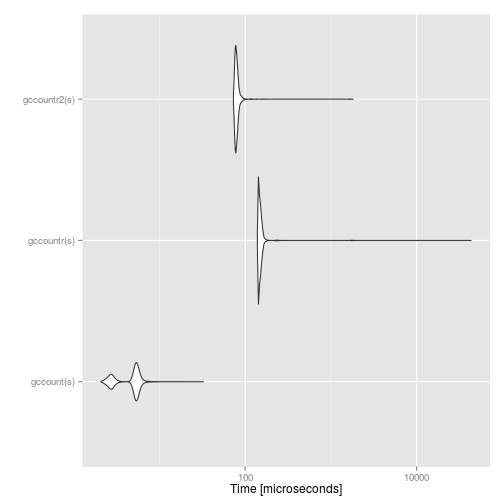

Benchamring, profiling and optimisation
===============


## Warning

Knuth, Donald. /Structured Programming with `go to` Statements/, ACM
Journal Computing Surveys, Vol 6, No. 4, Dec. 1974. p.268.

> We should forget about small efficiencies, say about 97% of the
> time: premature optimization is the root of all evil. Yet we should
> not pass up our opportunities in that critical 3%. A good programmer
> will not be lulled into complacency by such reasoning, he will be
> wise to look carefully at the critical code; but only after that
> code has been identified


Robert Gentleman, in R Programming for Bioinformatics, 2008,
about R's built-in C interfaces:

> Since R is not compiled, in some situations its performance can be
> substantially improved by writing code in a compiled language. There
> are also reasons not to write code in other languages, and in
> particular we caution against premature optimization, prototyping in
> R is often cost effective. And in our experience very few routines
> need to be implemented in other languages for efficiency
> reasons. Another substantial reason not to use an implementation in
> some other language is increased complexity. The use of another
> language almost always results in higher maintenance costs and less
> stability. In addition, any extensions or enhancements of the code
> will require someone that is proficient in both R and the other
> language.

(`Rcpp` does make some of the above caution statements slightly less
critical.)

## Timing


```r
m <- matrix(runif(1e4), nrow=1000)
system.time(apply(m, 1, sum))
```

```
##    user  system elapsed 
##   0.001   0.000   0.001
```


```r
replicate(5, system.time(apply(m, 1, sum))[[1]])
```

```
## [1] 0.002 0.001 0.001 0.002 0.002
```


## Benchmarking


```r
library("sequences")
gccount
```

```
## function (inseq) 
## {
##     .Call("gccount", inseq, PACKAGE = "sequences")
## }
## <environment: namespace:sequences>
```

```r
gccountr <- function(x) table(strsplit(x, "")[[1]])
gccountr2 <- function(x) tabulate(factor(strsplit(x, "")[[1]]))
```

Checking that our different implementations give the same results:


```r
s <- paste(sample(c("A", "C", "G", "T"),
                  100, replace = TRUE),
           collapse = "")

gccount(s)
```

```
## [1] 21 25 28 26
```

```r
gccountr(s)
```

```
## 
##  A  C  G  T 
## 21 25 28 26
```

```r
gccountr2(s)
```

```
## [1] 21 25 28 26
```

But are they really the same?


```r
library("microbenchmark")

mb <- microbenchmark(gccount(s),
                     gccountr(s),
                     gccountr2(s),
                     times = 1e4)
print(mb)
```

```
## Unit: microseconds
##          expr     min       lq       mean   median       uq       max
##    gccount(s)   2.074   2.8680   4.628888   5.2390   5.5180    32.680
##   gccountr(s) 137.416 143.5740 158.881456 146.9930 152.5725 43618.976
##  gccountr2(s)  71.933  76.7245  82.133342  78.7375  81.4075  1848.127
##  neval cld
##  10000 a  
##  10000   c
##  10000  b
```


```r
library("ggplot2")
autoplot(mb)
```

 


```r
library("rbenchmark")

benchmark(replications = 1e4,
          gccount(s),
          gccountr(s),
          gccountr2(s),
          columns=c('test', 'elapsed', 'replications'))          
```

```
##           test elapsed replications
## 3 gccountr2(s)   0.840        10000
## 2  gccountr(s)   1.586        10000
## 1   gccount(s)   0.051        10000
```

## Profiling 


```
> Rprof("rprof")
> res <- apply(m, 1, mean, trim=.3)
> Rprof(NULL)
> summaryRprof("rprof")
$by.self
                 self.time self.pct total.time total.pct
"mean.default"        0.02    33.33       0.06    100.00
"any"                 0.02    33.33       0.02     33.33
"unique.default"      0.02    33.33       0.02     33.33

$by.total
                 total.time total.pct self.time self.pct
"mean.default"         0.06    100.00      0.02    33.33
"apply"                0.06    100.00      0.00     0.00
"FUN"                  0.06    100.00      0.00     0.00
"any"                  0.02     33.33      0.02    33.33
"unique.default"       0.02     33.33      0.02    33.33
"sort.int"             0.02     33.33      0.00     0.00
"unique"               0.02     33.33      0.00     0.00

$sample.interval
[1] 0.02

$sampling.time
[1] 0.06
```

### The `lineprof` package

The example below is from the
[`lineprof`](https://github.com/hadley/lineprof) github repo.


```r
library(lineprof)
source(find_ex("read-delim.r"))
wine <- find_ex("wine.csv")

x <- lineprof(read_delim(wine, sep = ","), torture = TRUE)
shine(x)
```


`lineprof` displays five variables for each line of code:

- `t`: the amount of time spent on that line (in seconds)
- `r`, `a`: the amount of memory released and allocated (in
  megabytes). The assignment of memory release to a line of is not
  deterministic because it occurs only when `gc` is triggered.
- `d`: the number of duplicates

## Memory profiling


Memory usage using `tracemem` (requires to build `R` with `--enable-memory-profiling`)


```r
library(sequences)
(a <- new("DnaSeq", sequence = "GCATCAGCAGCT"))
```

```
## Object of class DnaSeq 
##  Id:  
##  Length: 12 
##  Alphabet: A C G T 
##  Sequence: GCATCAGCAGCT
```

```r
tracemem(a)
```

```
## [1] "<0x5647dc0>"
```

```r
seq(a) <- "GATC"
```

```
## tracemem[0x5647dc0 -> 0x57afb90]: eval eval withVisible withCallingHandlers doTryCatch tryCatchOne tryCatchList tryCatch try handle evaluate_call evaluate in_dir block_exec call_block process_group.block process_group withCallingHandlers process_file knit 
## tracemem[0x57afb90 -> 0x5619a90]: seq<- seq<- eval eval withVisible withCallingHandlers doTryCatch tryCatchOne tryCatchList tryCatch try handle evaluate_call evaluate in_dir block_exec call_block process_group.block process_group withCallingHandlers process_file knit
```

The illusion of copying


```r
x <- 1:10
tracemem(x)
```

```
## [1] "<0x414a028>"
```

```r
y <- x 
## 2 'copies' of x trigger a real copy
x[1] <- 1L
```

```
## tracemem[0x414a028 -> 0x3fcdc10]: eval eval withVisible withCallingHandlers doTryCatch tryCatchOne tryCatchList tryCatch try handle evaluate_call evaluate in_dir block_exec call_block process_group.block process_group withCallingHandlers process_file knit
```

```r
## Only one copy of x
x[1] <- 2L
```

## Object sizes

Approximate object's size


```r
object.size(rnorm(10000))
```

```
## 80040 bytes
```

```r
print(object.size(rnorm(10000)), units="auto")
```

```
## 78.2 Kb
```

```r
print(object.size(rnorm(1000000)), units="auto")
```

```
## 7.6 Mb
```

## Calling foreign languages

- Ris getting too slow or is not doing well in terms of memory management.
- Implement the heavy stuff in `C`, `C++` (http://www.rcpp.org/), `Fortran` or  `Java` (http://www.rforge.net/rJava/).


### Other scripting languages
- R/Perl: http://www.omegahat.org/RSPerl/ and 
- R/Python: http://www.omegahat.org/RSPython/ bidirectional interfaces

- There is also the `system()` function for direct access to OS functions

See C/C++ slides.


## Parallel execution

  See topic section.


## Environments

- An environment is a *isolated* collection of named objects, and a
  pointer to an enclosing environment.

- When calling a function, for example, its code is executed in an new
  environment; the function variables are local to that environment
  and distinct to those in your workspace (the `.GlobalEnv`).


```r
x <- 1
environment()
```

```
## <environment: R_GlobalEnv>
```

```r
f <- function() { print(environment()); x <- 2 }
f()
```

```
## <environment: 0x499f080>
```

```r
x
```

```
## [1] 1
```


- We can create and populate new environments:

```r
e <- new.env()
e
```

```
## <environment: 0x3b857f8>
```

```r
assign("x", value = 1, envir = e)
ls(envir = e)
```

```
## [1] "x"
```

```r
get("x", envir = e)
```

```
## [1] 1
```

- As well as lock/unlock bindings (with functions `lockBinding` and
  `unlockBonding`) or full environments (with `lockEnvironment`).

### Environments as function arguments

When passing an environment as function argument, it is **not**
copied: all its values are accessible within the function and can be
persistently modified.


```r
e <- new.env()
e$x <- 1
f <- function(myenv) myenv$x <- 2
f(e)
e$x
```

```
## [1] 2
```

This is used in the `eSet` et al. microarray data structures to store the expression data.

## Big data

- [CRAN High-Performance and Parallel Computing task view](http://cran.r-project.org/web/views/HighPerformanceComputing.html).
- Storing data in database or databases-like structures: `RMySQL`,
      `RdbiPgSQL`, \ldots, `RSQLite`, `qldf`, `data.table`, `dplyr`,
      ... packages.
- The `ff` package by Adler et al. offers file-based access to data
  sets that are too large to be loaded into memory, along with a
  number of higher-level functions.
- The `bigmemory` package by Kane and Emerson permits storing large
  objects such as matrices in memory (as well as via files) and uses
  `external pointer` objects to refer to them.
- `netCDF` data files: `ncdf` and `RNetCDF` packages.
- `hdf5` format: `rhdf5` package.
- hadoop
- ...


