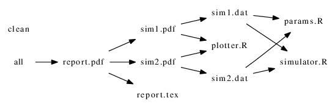

# Make and Makefiles

## Make and Makefiles

- Make is an automated build system, designed to avoid costly
  recomputation.

- `make` examines a *Makefile*, which contains a set of rules describing
  dependencies among files.

- A rule is run (i.e the recipes are executed) if the *target* is older than 
  any of its *dependencies* (*prerequisites*). 

```
target: prerequisites ...
     recipe
     ...
```

- `make` works backwards from the target to the prerequisites and
  compares creation time of files (`timestamp`).

## Make and Makefile

- Example:

```
res.txt: param1.dat param2.dat
         simulation param1.dat param2.dat > res1.dat
         post-process res1.dat > res.txt
```

- Commands to be run should be indented with a TAB.


## A complete Makefile 

See the `rr_make` directory.

```
report.pdf: report.tex sim1.pdf sim2.pdf 
	texi2pdf report.tex

sim1.dat: params.r simulator.r
	rscript simulator.r rnorm > sim1.dat

sim2.dat: params.r simulator.r
	rscript simulator.r runif > sim2.dat

sim1.pdf: sim1.dat plotter.r
	rscript plotter.r sim1.dat

sim2.pdf: sim2.dat plotter.r
	rscript plotter.r sim2.dat


.phony: all clean

all: report.pdf

clean:
	rm -f report.pdf report.log report.aux
	rm -f sim1.* sim2*
```


## Graphical description of dependencies



## Makefile conventions

   - PHONY targets: denote actions; ignore filenames with same
     name. PHONY targets are always out of date, and so always run.

```
.PHONY: all clean
all: report.pdf

clean:
	rm -f report.pdf report.log report.aux
	rm -f sim1.* sim2*
```

| command    | action                                |
|------------|---------------------------------------|
| make       | check first rule                      |
| make all   | rebuild everything                    |
| make clean | remove files that can be rebuilt      |
| touch file | update timestamp, preserving contents |

## Makefile: next steps

- variables
- implicit rules
- saving space:
```
sim2.dat: params.R simulator.R
	Rscript simulator.R runif > sim2.dat

sim2.dat: params.R simulation.R
	Rscript simulator.R runif > $@
```

- parallel processing `make -j2 job`

## Use case: [maker](https://github.com/computationalproteomicsunit/maker) - a `Makefile` for `R` packages

```
Usage:

 make TARGET PKG=package

Available targets:

 build                       - build source package
 vignettes                   - build vignettes in ./${PKGDIR}/vignettes
 check                       - build and check package
 check-only                  - check package and time checking
 bioccheck                   - build, check and BiocCheck package
 bioccheck-only              - BiocCheck package
 check-downstream            - check packages which depend on this package
 check-reverse-dependencies  - check packages which depend on this package
 clean                       - remove temporary files and .Rcheck
 clean-tar                   - remove .tar.gz archive
 clean-vignettes             - remove vignettes in inst/doc/
 clean-all                   - combine "clean" and "clean-all"
 compile-attributes          - run Rcpp::compileAttributes()
 help                        - show this usage output
 increment-version-major     - increment major version number (X++.1)
 increment-version-minor     - increment minor version number (1.X++)
 increment-version-patch     - increment patch version number (1.1.X++)
 install                     - build and install package
 install-only                - install package
 install-dependencies        - install package dependencies
 install-upstream            - install package dependencies
 release                     - build package for Bioc/CRAN release (includes vignettes etc.)
 remove                      - remove package
 roxygen                     - roxygenize package
 rd                          - roxygenize rd rocklet
 run-demos                   - source and run demo/*.R files
 targets                     - show this usage output
 usage                       - show this usage output
 win-builder                 - build package and send to win-builder.r-project.org

 maker                       - updates maker toolbox
 version                     - prints latest git hash and date of maker

Available variables:

 PKG                         - name of the target package (default is maker)
 PKGDIR                      - directory of the package (default is ./${PKG}/)
 VIG                         - should vignettes be build (default is 1). If 0, build --no-build-vignettes is used
 WARNINGS_AS_ERRORS          - fail on warnings (default is 1)
 CRAN                        - check using --as-cran (default is 0)
 COLOURS                     - using colours for R CMD check results (default is 1)
 RPROFILE                    - path to .Rprofile (default is /home/lg390/dev/00_github/maker//include//Rprofile)
 TIMEFORMAT                  - time format (default: empty)

Misc:

 Vignettes are not build when checking: R CMD check --no-build-vignettes

Version:

 8a2b59a [2014-10-13 12:08:55 +0200]
```

## Exercise

Write a `Makefile` for the `Rmd` file you wrote in the previous
session. Write 3 recipes:

1. for the `md` file
2. for the `html` output
3. for the `pdf` output

so that 2 and 3 have 1 as prerequisites.

Have a look at directories in the rbc repo to find examples.

Note that one can also include `Makefile`s inside package sub-directories
to automate some tasks. 

## Makefile references

- [Karl Broman's minimal make tutorial](http://kbroman.org/minimal_make/)

- Further reading: 
[http://linuxdevcenter.com/pub/a/linux/2002/01/31/make_intro.html](http://linuxdevcenter.com/pub/a/linux/2002/01/31/make_intro.html)

- Managing Projects with GNU Make 
[http://oreilly.com/catalog/make3/book/index.csp](http://oreilly.com/catalog/make3/book/index.csp)

- The GNU make manual 
[http://www.gnu.org/software/make/manual/make.html](http://www.gnu.org/software/make/manual/make.html)
