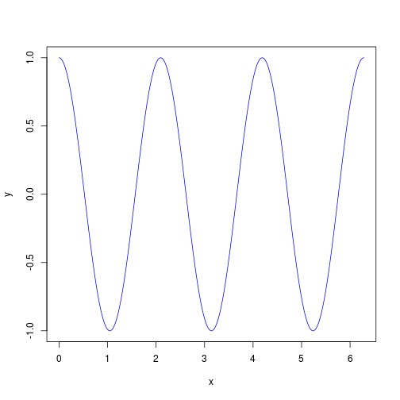

# My first simple Rmd file

Don't forget to install knitr package.


```r
install.packages("knitr")
```

# Introduction

This is an `.Rmd` document.  Maybe you have heard of `Sweave`?
Well, `knitr` is like modern `Sweave`.

* can work with markdown files (simpler) and LaTeX.
* more flexible re: graphics
* caching
* fancy look and feel.

## A simple example

Let's get R to do some simple maths.


```r
x <- 1:3
y <- 4:6
outer(x, y)
```

```
##      [,1] [,2] [,3]
## [1,]    4    5    6
## [2,]    8   10   12
## [3,]   12   15   18
```
As well as having chunks in separate paragaphs, you can have some
inline computation.  For example, the mean of x is 2 and
the sum of x and y is 5, 7, 9.  Chunks can be named and then
referred to later.

## Plotting is easy too


```r
x <- seq(from=0, to=2*pi, length=1000)
y <- cos(3*x)
plot(x, y, type='l', col='blue')
```

 

## Tables are not so straightforward (in markdown)

See also the [xtable](http://cran.r-project.org/web/packages/xtable/)
package.


```r
kable(head(iris[,1:3]), format='html')
```

<table>
 <thead>
  <tr>
   <th style="text-align:right;"> Sepal.Length </th>
   <th style="text-align:right;"> Sepal.Width </th>
   <th style="text-align:right;"> Petal.Length </th>
  </tr>
 </thead>
<tbody>
  <tr>
   <td style="text-align:right;"> 5.1 </td>
   <td style="text-align:right;"> 3.5 </td>
   <td style="text-align:right;"> 1.4 </td>
  </tr>
  <tr>
   <td style="text-align:right;"> 4.9 </td>
   <td style="text-align:right;"> 3.0 </td>
   <td style="text-align:right;"> 1.4 </td>
  </tr>
  <tr>
   <td style="text-align:right;"> 4.7 </td>
   <td style="text-align:right;"> 3.2 </td>
   <td style="text-align:right;"> 1.3 </td>
  </tr>
  <tr>
   <td style="text-align:right;"> 4.6 </td>
   <td style="text-align:right;"> 3.1 </td>
   <td style="text-align:right;"> 1.5 </td>
  </tr>
  <tr>
   <td style="text-align:right;"> 5.0 </td>
   <td style="text-align:right;"> 3.6 </td>
   <td style="text-align:right;"> 1.4 </td>
  </tr>
  <tr>
   <td style="text-align:right;"> 5.4 </td>
   <td style="text-align:right;"> 3.9 </td>
   <td style="text-align:right;"> 1.7 </td>
  </tr>
</tbody>
</table>

# Okay, what do you need to know?


1. What is markdown syntax?  [Markdown](http://daringfireball.net/projects/markdown)

2. What can `knitr` do? [Knitr home page](http://yihui.name/knitr/)


# Exercise:

Take a look at the example for estimating PI using a well-known method
of throwing darts at a dartboard.

[Estimating PI](http://www.damtp.cam.ac.uk/user/eglen/rguide/estimate.pdf)

Can you generate something similar with an .Rmd document?  Work on the
basics of estimating pi and attempt the last figure only if you have
time.

# What are vignettes?

Vignettes are self-contained documents that typically describe in
detail how a package works.  See a list of them with `vignette()`.
*knitr* has many vignettes, e.g. `vignette('knitr-refcard')`.

# Installing vignettes into a package.

- add `*.Rmd` files under the `vignettes` directory
- add `VignetteBuilder: knitr` to the `DESCRIPTION` file
- specify the vignette engine `\VignetteEngine{knitr::knitr}` in the
  `Rmd` files (inside HTML comments)

# How to compile this document

This should work cross platform; first, the document is knitted to
make a markdown file; then the "markdown" package converts this to
html which can be rendered.


```r
library("knitr")
knit2html("simple.Rmd")
if (interactive()) browseURL("simple.html")
```

In R studio, it is even simpler; just hit the special "Knit HTML" button!

If you prefer the pdf format you need to have a latex compiler, so the
following may not work for you:


```r
require("knitr")
## Rmd -> md
knit('simple.Rmd')
## Rmd -> html
knit2html('simple.Rmd')
browseURL('simple.html') ## view it

## Rnd -> pdf
knit2pdf("simple.Rmd")
```

## About this document


```r
sessionInfo()
```

```
## R Under development (unstable) (2014-11-01 r66923)
## Platform: x86_64-unknown-linux-gnu (64-bit)
## 
## locale:
##  [1] LC_CTYPE=en_GB.UTF-8       LC_NUMERIC=C              
##  [3] LC_TIME=en_GB.UTF-8        LC_COLLATE=en_GB.UTF-8    
##  [5] LC_MONETARY=en_GB.UTF-8    LC_MESSAGES=en_GB.UTF-8   
##  [7] LC_PAPER=en_GB.UTF-8       LC_NAME=C                 
##  [9] LC_ADDRESS=C               LC_TELEPHONE=C            
## [11] LC_MEASUREMENT=en_GB.UTF-8 LC_IDENTIFICATION=C       
## 
## attached base packages:
## [1] stats     graphics  grDevices utils     datasets  methods   base     
## 
## other attached packages:
## [1] knitr_1.7
## 
## loaded via a namespace (and not attached):
## [1] evaluate_0.5.5 formatR_1.0    stringr_0.6.2  tools_3.2.0
```
